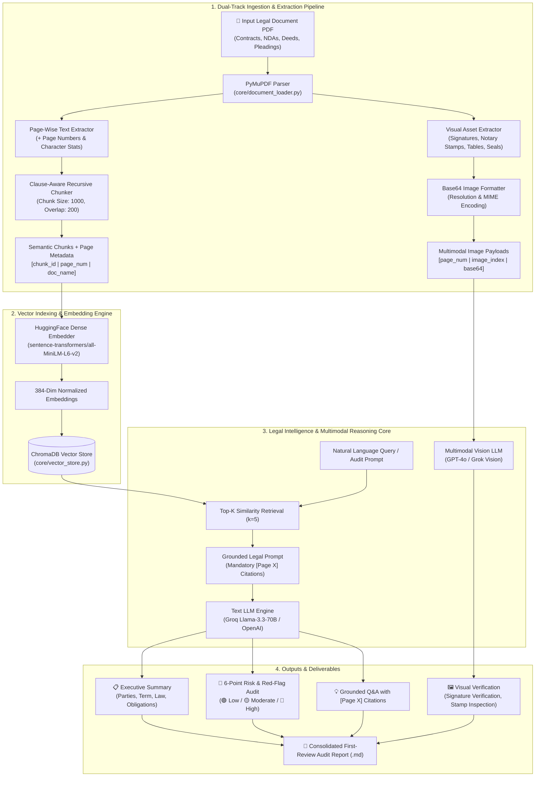
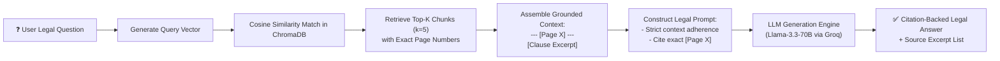
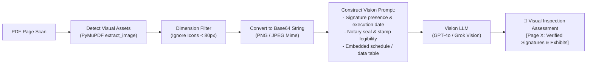
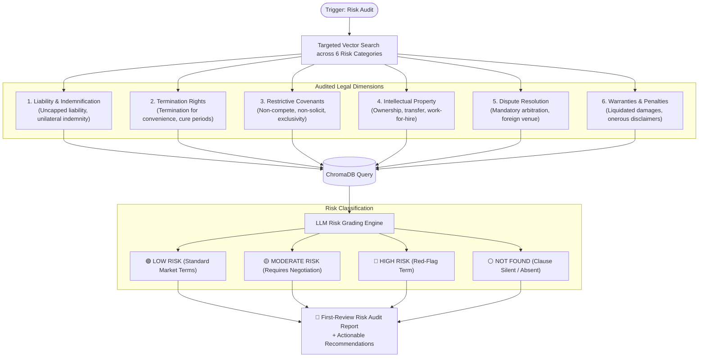
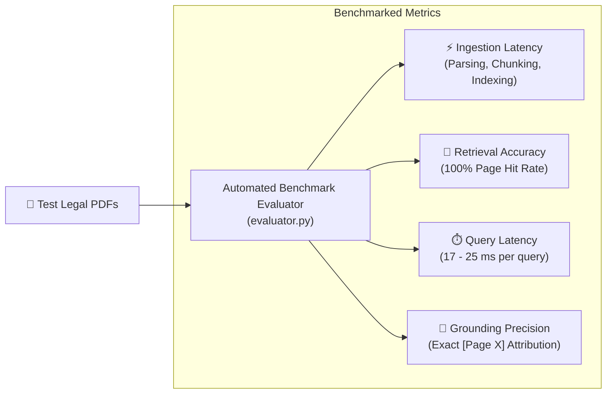

# 📊 Proposed Solution Workflow & Architecture

## 1. 🏛️ Complete End-to-End System Architecture (Text + Multimodal Vision)

---

## 2. 🔄 Text RAG (Retrieval-Augmented Generation) Pipeline

---

## 3. 🖼️ Multimodal Signature & Visual Inspection Pipeline

---

## 4. 🚩 6-Point Risk & Red-Flag Audit Decision Tree

---

## 5. 📊 Automated Evaluation & Benchmarking Flow

